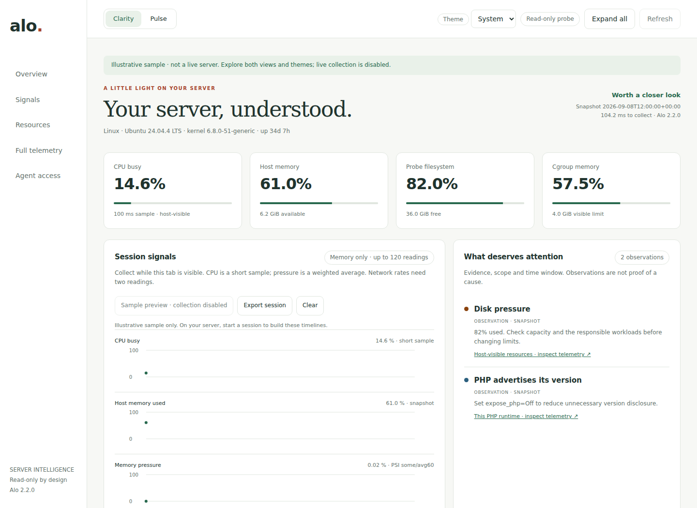
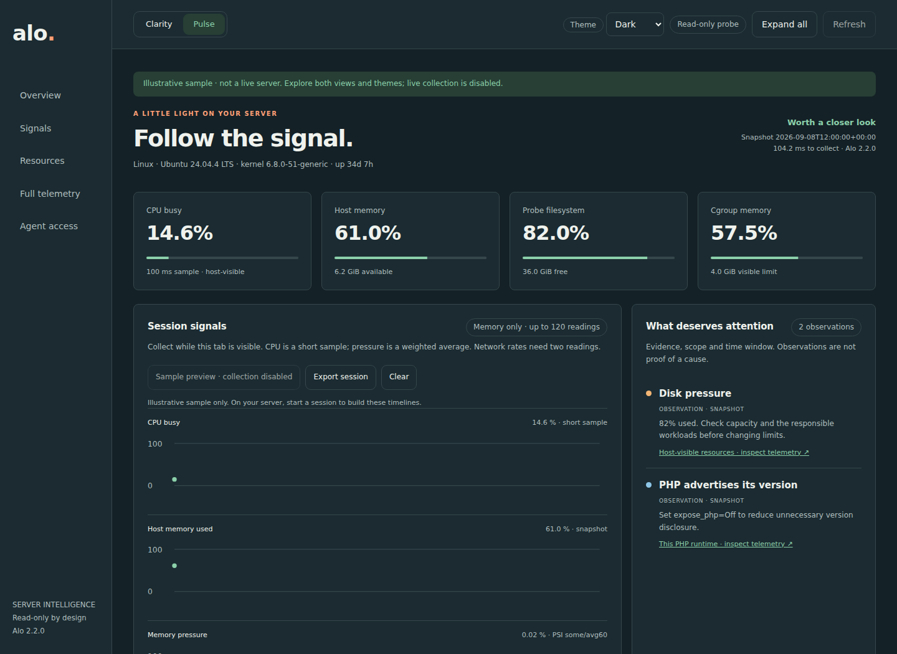
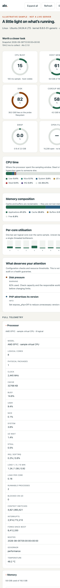

<div align="center">

# alo.
### A little light on your server.

**A private, single-file server dashboard. Built for humans. Ready for AI agents.**

[](https://github.com/Asif2BD/Alo/actions/workflows/ci.yml)
[](https://www.php.net/supported-versions.php)
[](tests/)
[](#)
[](#install-in-one-line)
[](gpl-3.0.txt)

[Install](#install-in-one-line) · [What it shows](#what-it-shows) · [AI & MCP](docs/agents.md) · [Server support](docs/hosting.md) · [Security](SECURITY.md) · [Contribute](CONTRIBUTING.md)



*Actual Alo interface rendered with illustrative sample data. This is not a live server or benchmark.*

</div>


## Three experiences, one project

- **Clarity** is the default dashboard: a calm overview, CPU signal, resource anatomy and scoped observations.
- **Pulse** is the selectable investigation view: aligned CPU, memory, PSI and network timelines.
- **Launch** is the public [homepage](https://alo.asif.dev), install guide and [sample demo](https://alo.asif.dev/demo.html). It never exposes live server telemetry.

Clarity and Pulse both support light, dark and system themes. Only view/theme preferences enter local storage. Session collection is opt-in, runs every 30 seconds while the tab is visible, stops on errors, and retains at most 120 compact readings **in browser memory**. Reloading clears history. Long gaps and unavailable values break charts; network rates require two compatible readings and a known unchanged boot identity. Very fast counter resets that recover between samples cannot be detected. Full telemetry panels describe the initial snapshot until you refresh.



Explore both views in the [public sample demo](https://alo.asif.dev/demo.html); live production metrics remain private.

## A bounded stream for agents

```sh
php alo.php --watch --interval=30 --count=20
```

One complete JSON snapshot per line, starting immediately. Intervals are 30–300 seconds, counts 1–120, and the total waiting period cannot exceed one hour. The CLI requires local/SSH access and reports the CLI PHP runtime. It does not hold a web worker open or accept remote commands. Use authenticated JSON/MCP for the web runtime. Counters remain raw; consumers must compute reset-aware deltas.

Observations include `state`, `scope`, `window` and `evidence_family`. Cumulative OOM, throttling, retransmission and restart events are labeled **historical**, not current incidents. No absence of alerts constitutes a health guarantee.

## Install in one line

Run as your site user in an existing HTTPS web directory. You need curl and 64-bit PHP 8.3+. Linux exposes the richest metrics; other systems report unavailable readings honestly.

```sh
curl -fsSL https://alo.asif.dev/install.sh | sh -s -- --setup
```

`--setup` generates a 256-bit token, stores **only its SHA-256 digest**, and prints the token once:

```
  Alo is ready.

  Username  alo
  Token     f6f057d1bc5efbebd0be00aaf14606a4db6ae587f799e379fd148305c4afd198
```

The bootstrap is trusted through HTTPS. You can [inspect and download it](https://alo.asif.dev/install.sh) before execution. Its embedded SHA-256 pins the payload and detects changes; it is not an independent signature. The installer validates PHP and replaces `alo.php` atomically, preserving access configuration. Use `--dir /path/to/webroot` to choose the destination, or `PHP_BINARY` to select PHP. Run without `--setup` for an upgrade. Keep your previously verified `alo.php` outside the web root if you need rollback; restore that file without replacing the digest.

Open `alo.php` over HTTPS. Verify **401 without credentials and 200 with credentials**. The web PHP worker must own or be able to read the 0600 digest; CLI success does not prove web-worker access. Never make the digest world-readable to fix an ownership mismatch.

Run `php alo.php --check --json` for CLI readiness. `web_verified: false` explicitly means HTTPS, authentication and the actual PHP web worker still need verification.

### Where the digest goes

`--setup` writes `alo-hash.php` next to the probe. It is a PHP file whose first statement is `exit`, so a
web server willing to run `alo.php` runs this too and returns **nothing** when PHP is correctly configured. Keep it private; a broken PHP handler can expose source files. It is written `0600`, and it holds a digest, not a credential: it cannot be replayed, and inverting
SHA-256 over 256 bits of randomness is infeasible.

If you would rather keep the digest off the filesystem entirely, set `ALO_TOKEN_HASH` in the web PHP
environment instead. **The environment variable always wins**, so a hardened deployment behaves exactly as
it did before this convenience existed.

### Installing without a shell

Panel, FTP or SFTP only? Run `--setup` on your own machine, then upload **both** `alo.php` and the
generated `alo-hash.php`. Nothing on the server needs configuring.

### Installing from an agent or a script

Commands are non-interactive. Repeated setup refuses an existing digest; only explicit `--force` rotates access. Capture setup output directly into your secret store, not build logs.

```sh
php alo.php --setup --json     # {"ok":true,"token":"...","hash":"...","hash_file":"..."}
php alo.php --check --json     # readiness report; exit 0 when ready
```

| Exit | Meaning |
| --- | --- |
| `0` | Done |
| `1` | `--check` only: not ready; see `warnings` |
| `2` | Unknown argument |
| `3` | Already configured — refuses to silently invalidate a live token. Add `--force` to rotate |
| `4` | Could not write the digest; the message includes the `ALO_TOKEN_HASH` value to set instead |

An agent pushing Alo to a fleet can therefore run the one-liner, parse the token out of
`--setup --json`, store it in its own secret store, and check CLI readiness with `--check --json`. Then verify the actual HTTPS endpoint with and without authentication. Keep the raw token out of logs and committed files.

For containers and immutable infrastructure, skip `--setup` and pass the digest in:

```sh
docker run -e ALO_TOKEN_HASH=$(php -r 'echo hash("sha256", "YOUR-TOKEN");') ...
```

### Rotating or removing

```sh
php alo.php --setup --force    # new token, old one stops working immediately
rm alo-hash.php                # back to locked; Alo returns 503 and collects nothing
```

## Why Alo?

Understand the environment serving your application without installing a monitoring stack. Upload one file,
authenticate, and see the resource usage, runtime details and configuration observations that matter. Alo
never sends telemetry or loads third-party assets.

| For people | For agents | For administrators |
| --- | --- | --- |
| Clean, responsive dashboard | Authenticated JSON snapshots | HTTPS and generated access tokens |
| Charts and collapsible detail | Read-only MCP tools | One command to install, one to rotate |
| Light and dark themes | Explicit units, scope, and missing data | No shell execution or database credentials |
| Resource pressure explained | Machine-readable capability manifest | One file; the digest is not a credential |

## What it shows

The dashboard opens with resource summaries, a CPU-time breakdown, a memory composition bar, and per-core
utilisation. Everything else is stacked into collapsible sections, so the page stays readable while still
carrying several hundred metrics.

- **Processor:** per-core busy percentages, where CPU time went (user, system, I/O wait, **steal**, IRQ, idle), model, clock, cache, load average and load per core, runnable and blocked processes, context switches, interrupts and boot time.
- **Memory:** the full `/proc/meminfo` composition — used, available, cache, buffers, shared, anonymous, mapped, active/inactive, dirty, writeback, slab, page tables, commit limit and huge pages — plus swap.
- **Pressure:** Pressure Stall Information for CPU, memory and I/O over 10, 60 and 300 second windows. This catches contention that a utilisation percentage hides.
- **Paging:** page faults, major faults, swap in/out, direct reclaims and kernel OOM kills.
- **Storage:** every real mounted filesystem with its own usage, then cumulative per-device reads, writes, bytes and busy time.
- **Network and sockets:** per-interface counters with link speed, MTU and state, plus TCP/UDP protocol counters, established connections, time-wait sockets and the retransmit rate.
- **Containers:** cgroup v2 memory with its soft limit and peak, `memory.events` including **OOM kills**, CPU quota with **throttled periods and time**, and process counts against `pids.max`.
- **Kernel:** distribution, kernel version, file-descriptor usage against the limit, CPU temperature, scaling governor, entropy and selected sysctls.
- **PHP:** version and branch lifecycle, Zend engine, thread safety, selected configuration, extensions with versions, PDO client drivers, and worker memory.
- **OPcache:** memory, waste, hit rate, hits and misses, cached scripts and keys, interned strings, restart counters and JIT buffer state, without cached file paths.
- **Observations:** capacity thresholds, container throttling and OOM kills, sustained pressure, hypervisor steal, descriptor exhaustion, retransmits and risky PHP settings — each with a practical next step.
- **Server family:** LiteSpeed/OpenLiteSpeed, Nginx, Apache, Caddy, and IIS where the runtime exposes identification.

<details>
<summary><strong>Dark theme and mobile screenshots</strong></summary>




*Screenshots use the same illustrative fixture, not production measurements.*

</details>

## Manual install

Prefer to do it by hand, or need the digest in the environment rather than a file?

1. Download `alo.php` from a reviewed release or checkout.
2. Generate a token and digest without writing anything to disk:

   ```sh
   php alo.php --generate-token
   ```

3. Set the printed `ALO_TOKEN_HASH` in your control panel, PHP-FPM pool, or LSAPI environment — outside
   the document root. A PHP-FPM pool with `clear_env` enabled needs an explicit entry:

   ```ini
   env[ALO_TOKEN_HASH] = "<the printed sha256 digest>"
   ```

4. Upload only `alo.php` to a location served over HTTPS, and reload the PHP handler.

An installation with no configured digest returns `503` and collects nothing. That is the intended locked
state, not an error.


## Server compatibility

| Environment | Current scope |
| --- | --- |
| LiteSpeed Enterprise / OpenLiteSpeed + LSAPI | PHP diagnostics, host-visible metrics, family identification |
| Apache + mod_php or PHP-FPM | Same probe; no Apache status-module dependency |
| Nginx / Caddy + PHP-FPM | Same probe; family visible only if passed to PHP |
| IIS + FastCGI | PHP diagnostics and available disk metrics; Linux `/proc` metrics unavailable |
| Containers / shared hosting | Best-effort metrics, explicitly scoped; denied readings become `null` |

These are architectural compatibility targets. Automated tests cover PHP versions, fixture-based server detection, HTTP behavior, and restricted functions. They are not a claim of live validation on every hosting product. [Deployment notes and limitations →](docs/hosting.md)

## Understand the readings

Alo is a **snapshot**, not a monitoring daemon or a security certification. It stores no server-side history. Optional browser sessions poll every 30 seconds while visible; local CLI watch is explicitly bounded. CPU sampling takes about 100 ms. Capacity observations start at 80% warning / 90% critical; they are investigation prompts, not universal operational limits.

Host-visible CPU/RAM may describe the host rather than a container. Cgroup data covers the visible v2 root, not necessarily the PHP worker's nested limits. Disk covers the filesystem containing the probe, not all disks, inodes, or quotas. Network counters are cumulative. PDO drivers do not establish database connectivity. Missing readings stay `null`; they never mean “healthy.”

PHP lifecycle dates were reviewed **2026-09-08** against [PHP's support schedule](https://www.php.net/supported-versions.php). They do not verify patch currency. Full metric semantics are in the authenticated manifest and [agent guide](docs/agents.md).

## Upgrading from Alo 1.x

This is a breaking replacement. Configure authentication and HTTPS before switching. Remove the old public probe; do not leave a renamed backup accessible in the document root.

Public `phpinfo`, JSONP/realtime routes, function tests, database connection tests, mail sending, I/O tests, and stress/speed benchmarks are removed. Migrate consumers to the authenticated JSON/MCP interfaces. Renaming the file is no longer treated as access control.

## Telemetry for a fleet

Alo is a scrape target, not an agent. It never makes an outbound request, so a server manager pulls from
it on its own schedule and Alo keeps no state between calls.

```sh
curl -H "Authorization: Bearer $TOKEN" "https://host/alo.php?format=metrics&sample=0"
```

`?format=metrics` returns **OpenMetrics 1.0**. Cumulative series are typed as counters and exported raw —
the scraper differentiates two scrapes into a rate, which is why Alo needs no history and no database.
Percentages are exported as `0–1` ratios. **A reading Alo could not take is omitted entirely**, never
exported as zero, because a zero averages into a dashboard as though it had been measured.

| Lever | Why |
| --- | --- |
| `?sample=0` | Skips the CPU sampling sleep, which is most of a request's cost. Busy percentages come back `null` instead of fabricated. Everything else is unaffected |
| `?fields=memory,disk` | Trims a JSON snapshot to the families you asked for |
| `ALO_INSTANCE=web-01` | Labels the instance for a fleet. Alo never derives an identity from a hostname or address |
| `Server-Timing` | Every response reports what collection cost |

Set the interval no tighter than 30 seconds, and prefer `sample=0` below 60.

## Tests

**200 automated checks** run on every push against **PHP 8.3, 8.4 and 8.5**:

```sh
php tests/run.php        # 115 checks: parsers, chart geometry, insights, escaping
python3 tests/test_http.py # 85 checks: real HTTP, auth, MCP, install
```

They cover the metric parsers against fixture procfs data, the chart helpers' clamping and escaping,
every insight threshold, and — over real HTTP against a real PHP server — the access controls, the MCP
transport, and the install flow including the guarantee that the digest sidecar returns an empty body.

CI additionally runs Alo with `disable_functions` set, to prove that a restricted host degrades to
"Unavailable" instead of failing.

## Development and contributions


## License and history

**GPL-3.0-only** — [license](gpl-3.0.txt).

- **2.0** — Modern PHP rebuild; private access; redesigned dashboard; structured insights; JSON/MCP; tests and contributor documentation.
- **1.1 · 2016-03-02** — PHP 7 compatibility.
- **1.0 · 2013-04-09** — Initial release.

The original Alo was based on an earlier Chinese-language GPL server-probe script. Version 2 replaces the legacy implementation while retaining its lightweight purpose and GPL license.

Created by **[M Asif Rahman](https://ar.bd/)**.
